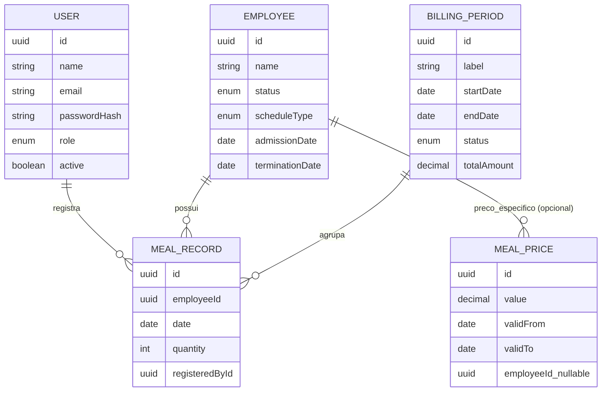

# PRD — Sistema de Controle de Pedidos de Almoço para Funcionários

**Versão:** 1.0 (rascunho para validação)
**Data:** 18/06/2026
**Autor:** RH + análise técnica
**Status:** Em revisão — contém premissas e perguntas abertas a confirmar antes do desenvolvimento

---

## 1. Visão Geral

Hoje o controle de quem pegou almoço, em que quantidade e a que custo é feito manualmente em uma planilha Excel, em uma conversa recorrente entre o RH e a gestora responsável pelos funcionários. O objetivo deste projeto é substituir esse processo por um sistema web com dois perfis de acesso (RH e Gestora), onde:

- a Gestora registra diariamente quem pegou almoço e em que quantidade;
- o RH configura o valor do almoço praticado pelo restaurante parceiro;
- o sistema calcula automaticamente os totais por funcionário e o total geral, respeitando jornadas de trabalho diferentes (Segunda a Sexta vs. Segunda a Segunda);
- ao final de cada ciclo, o RH fecha o período e obtém um relatório consolidado para pagar o restaurante e descontar o valor correto na folha de cada funcionário.

## 2. Problema Atual

A análise da planilha em uso (43 abas cobrindo aproximadamente um ano) evidenciou os seguintes pontos de dor, que o sistema precisa resolver:

- **Erro e retrabalho manual**: existem múltiplas abas de "ACERTO" (ajuste), indicando que fechamentos calculados à mão precisaram ser corrigidos depois.
- **Preço do almoço inconsistente entre abas**: o valor unitário muda de período para período (ex.: R$5,50) e em ao menos um caso há preço diferenciado por pessoa (ex.: um funcionário a R$11,00 enquanto os demais pagavam R$5,50), sem um registro estruturado de "a partir de quando" cada preço passou a valer.
- **Ciclo de fechamento não coincide com o mês civil**: várias abas mostram o fechamento ocorrendo no dia 6 do mês seguinte (ex.: "descontar funcionário 06-04"), e não do dia 1 ao 30/31.
- **Falta de padronização da lista de funcionários**: nomes aparecem com grafias diferentes entre abas (ex.: "PR DÁRIO" / "PR DARIO" / "DARIO"), o que dificulta consolidar histórico.
- **Sem rastreabilidade de jornada**: a planilha não diferencia formalmente quem trabalha Seg-Sex de quem trabalha Seg-Dom; isso é inferido manualmente olhando se há lançamento no sábado/domingo.
- **Sem trilha de quem alterou o quê**: não há registro de quem lançou ou editou cada informação.

## 3. Objetivos do Produto

1. Eliminar o cálculo manual de totais e o retrabalho de "acertos" posteriores.
2. Centralizar o cadastro de funcionários, jornadas e preços em um único lugar, com histórico.
3. Permitir que a Gestora faça o lançamento diário de forma simples (substituindo a grade da planilha por uma interface equivalente, mas validada e com soma automática).
4. Dar ao RH visibilidade e controle total: configurar preços, fechar períodos e extrair o relatório para pagamento ao restaurante e desconto em folha.
5. Manter histórico íntegro e auditável, sem perda de dados entre meses (diferente do arquivo atual, que é um "Excel recuperado automaticamente").

## 4. Personas e Papéis

| Persona | Quem é | O que faz no sistema |
|---|---|---|
| **RH** | Administrador do sistema | Cadastra funcionários, define jornada de cada um, configura o preço do almoço (com vigência), cria login da(s) Gestora(s), fecha o período de faturamento, gera/exporta o relatório mensal, acessa o dashboard completo |
| **Gestora** | Responsável operacional pelos funcionários que recebem almoço | Lança/edita diariamente a quantidade de almoços por funcionário, consulta o relatório do período em andamento, acessa o dashboard do seu time |
| *(Futuro, fora do MVP)* **Funcionário** | Quem recebe o almoço | Consulta seu próprio extrato de consumo do mês |

### Matriz de permissões (MVP)

| Funcionalidade | RH | Gestora |
|---|---|---|
| Login no sistema | ✅ | ✅ |
| Cadastrar / editar / inativar funcionário | ✅ | ❌ (somente visualiza) |
| Definir jornada do funcionário (Seg-Sex / Seg-Dom) | ✅ | ❌ |
| Configurar preço do almoço (global ou por funcionário) | ✅ | ❌ |
| Lançar quantidade de almoço do dia | ✅ | ✅ |
| Editar lançamento de período **aberto** | ✅ | ✅ |
| Editar lançamento de período **fechado** | ❌ | ❌ |
| Fechar período de faturamento | ✅ | ❌ |
| Gerar / exportar relatório mensal (pagamento + desconto) | ✅ | 🔶 (somente visualizar) |
| Criar/gerenciar usuários do sistema | ✅ | ❌ |
| Visualizar dashboard | ✅ (geral) | ✅ (seu time) |

## 5. Escopo

### Dentro do MVP
- Autenticação com login e senha, dois papéis (RH, Gestora).
- CRUD de funcionários (nome, status ativo/inativo, jornada de trabalho, data de admissão/desligamento).
- Configuração de preço do almoço com vigência por data (e suporte a preço específico por funcionário, caso necessário — ver Seção 12).
- Lançamento diário de quantidade de almoço por funcionário, em formato de grade similar à planilha atual.
- Cálculo automático de totais (por dia, por funcionário, por período).
- Suporte a jornadas diferentes (Seg-Sex e Seg-Dom), incluindo alerta se um funcionário Seg-Sex tiver lançamento em dia não previsto.
- Definição de ciclo/período de faturamento (não necessariamente igual ao mês civil), fechamento do período e geração de relatório exportável (Excel/PDF) com: total a pagar ao restaurante e tabela de desconto por funcionário.
- Dashboard com indicadores principais (total do mês, comparação com período anterior, ranking de consumo).

### Fora do MVP (backlog futuro)
- Múltiplas Gestoras com times/setores segmentados.
- Autoatendimento do funcionário (consulta do próprio extrato).
- Envio automático do relatório por e-mail ao RH/restaurante.
- Integração direta com sistema de folha de pagamento (ex.: eSocial, ERPs de RH).
- Aplicativo mobile nativo (o MVP cobre responsividade web/mobile via navegador).
- Importação automatizada do histórico da planilha atual (recomendado como projeto complementar — ver Seção 13).

## 6. Requisitos Funcionais

### RF01 — Autenticação e Autorização
- O sistema deve permitir login via e-mail/usuário e senha.
- Senhas devem ser armazenadas com hash (bcrypt ou equivalente), nunca em texto puro.
- O sistema deve diferenciar sessões por papel (RH, Gestora) e restringir telas/ações conforme a matriz de permissões (Seção 4).
- O RH deve poder criar, editar e inativar contas de usuário (incluindo a(s) conta(s) de Gestora).

### RF02 — Cadastro de Funcionários (CRUD)
- Campos mínimos: nome completo, status (ativo/inativo), jornada de trabalho (Seg-Sex, Seg-Dom ou personalizada), data de admissão, data de desligamento (quando aplicável).
- Inativar um funcionário não deve apagar seu histórico de lançamentos passados.
- Deve ser possível buscar/filtrar funcionários por nome e por status.

### RF03 — Configuração de Preço do Almoço
- O RH deve poder cadastrar um novo valor de almoço com data de início de vigência.
- Lançamentos anteriores à mudança de preço devem continuar usando o valor vigente na época (preço histórico preservado, nunca recalculado retroativamente por uma mudança futura).
- O sistema deve suportar, opcionalmente, um preço diferente para um funcionário específico (sobrescrevendo o preço padrão), já que isso ocorreu na planilha atual.

### RF04 — Lançamento Diário de Almoço
- A Gestora (ou o RH) deve poder, para cada dia do período em aberto, informar a quantidade de almoços de cada funcionário (0, 1 ou mais).
- A interface deve ser em formato de grade (funcionário × dia), equivalente ao padrão já usado na planilha, para minimizar a curva de aprendizado.
- O sistema deve calcular automaticamente, em tempo real: total do dia (todos os funcionários) e total do funcionário (até o momento, no período).
- Deve ser possível editar um lançamento já feito, enquanto o período estiver aberto.
- Lançamentos de períodos fechados devem ser somente leitura.

### RF05 — Jornada de Trabalho
- Cada funcionário deve ter uma jornada associada (Seg-Sex ou Seg-Dom, no mínimo).
- O sistema deve emitir um alerta (não necessariamente bloquear) quando um lançamento for feito em um dia fora da jornada esperada do funcionário (ex.: domingo para alguém cadastrado como Seg-Sex).

### RF06 — Fechamento de Período e Relatório
- O RH deve poder definir o período de faturamento (data de início e fim), que pode ou não coincidir com o mês civil, replicando a flexibilidade observada na planilha atual (ciclos que fecham, por exemplo, no dia 6 do mês seguinte).
- Ao fechar um período, o sistema deve travar os lançamentos daquele período (somente leitura) e congelar os valores calculados.
- O relatório de fechamento deve apresentar: total geral a pagar ao restaurante; tabela por funcionário com quantidade de almoços e valor a descontar; preço unitário aplicado.
- O relatório deve ser exportável em Excel e/ou PDF.

### RF07 — Dashboard
- Indicadores mínimos: total de almoços e valor do período em andamento; comparação com o período anterior; ranking de funcionários por consumo; gráfico de evolução diária.
- Visão do RH deve agregar todos os funcionários; visão da Gestora pode ser restrita ao seu time (caso exista segmentação — ver Seção 12, pergunta 1).

## 7. Requisitos Não Funcionais

- **Segurança**: senhas com hash, sessão autenticada via token (JWT), HTTPS em produção, controle de acesso por papel em todas as rotas da API (não apenas na interface).
- **Auditoria**: todo lançamento e alteração de preço deve registrar quem fez e quando.
- **Confiabilidade**: o banco de dados (PostgreSQL) deve ter rotina de backup; diferente do arquivo Excel atual ("recuperado automaticamente"), perda de dados não é uma opção aceitável.
- **Usabilidade**: a tela de lançamento diário deve funcionar bem em notebook e em tablet/celular, já que a Gestora pode preencher fora do computador.
- **Desempenho**: o sistema deve suportar múltiplos anos de histórico (a planilha atual já cobre ~1 ano com dezenas de funcionários) sem degradação perceptível.
- **Manutenibilidade**: uso de ORM (Prisma) com migrations versionadas, evitando alterações manuais de schema.

## 8. Modelo de Dados (proposta inicial)



### Rascunho de schema Prisma (ponto de partida, a refinar com o time de backend)

```prisma
model User {
  id           String   @id @default(uuid())
  name         String
  email        String   @unique
  passwordHash String
  role         Role
  active       Boolean  @default(true)
  createdAt    DateTime @default(now())
  updatedAt    DateTime @updatedAt
  mealRecords  MealRecord[] @relation("RegisteredBy")
}

enum Role {
  RH
  GESTORA
}

model Employee {
  id              String         @id @default(uuid())
  name            String
  status          EmployeeStatus @default(ACTIVE)
  scheduleType    ScheduleType   @default(MON_FRI)
  admissionDate   DateTime?
  terminationDate DateTime?
  createdAt       DateTime       @default(now())
  updatedAt       DateTime       @updatedAt
  mealRecords     MealRecord[]
  priceOverrides  MealPrice[]
}

enum EmployeeStatus {
  ACTIVE
  INACTIVE
}

enum ScheduleType {
  MON_FRI
  MON_SUN
  CUSTOM
}

model MealPrice {
  id         String    @id @default(uuid())
  value      Decimal   @db.Decimal(10, 2)
  validFrom  DateTime
  validTo    DateTime?
  employeeId String?   // null = preço padrão (global)
  employee   Employee? @relation(fields: [employeeId], references: [id])
  createdAt  DateTime  @default(now())
}

model MealRecord {
  id             String   @id @default(uuid())
  employeeId     String
  employee       Employee @relation(fields: [employeeId], references: [id])
  date           DateTime
  quantity       Int      @default(1)
  registeredById String
  registeredBy   User     @relation("RegisteredBy", fields: [registeredById], references: [id])
  createdAt      DateTime @default(now())
  updatedAt      DateTime @updatedAt

  @@unique([employeeId, date])
}

model BillingPeriod {
  id          String        @id @default(uuid())
  label       String
  startDate   DateTime
  endDate     DateTime
  status      BillingStatus @default(OPEN)
  closedAt    DateTime?
  closedById  String?
  totalAmount Decimal?      @db.Decimal(10, 2)
  createdAt   DateTime      @default(now())
}

enum BillingStatus {
  OPEN
  CLOSED
}
```

## 9. Arquitetura Técnica

- **Banco de dados**: PostgreSQL.
- **ORM / Migrations**: Prisma ORM (Node.js), com migrations versionadas no repositório.
- **Backend**: Node.js (Express ou Fastify), API REST, autenticação via JWT, middleware de autorização por papel.
- **Frontend**: React + styled-components, consumindo a API REST.
- **Ambientes**: separação clara entre desenvolvimento, homologação e produção, com variáveis de ambiente para credenciais e segredos (nunca hardcoded).

### Visão dos principais endpoints (rascunho)

```
POST   /api/auth/login

GET    /api/employees
POST   /api/employees
PUT    /api/employees/:id
DELETE /api/employees/:id        (soft-delete -> inativa)

GET    /api/meal-prices
POST   /api/meal-prices          (RH apenas)

GET    /api/meal-records?periodId=...
POST   /api/meal-records         (lançamento de um dia/funcionário)
POST   /api/meal-records/bulk    (lançamento em lote, estilo grade)
PUT    /api/meal-records/:id

GET    /api/billing-periods
POST   /api/billing-periods
POST   /api/billing-periods/:id/close     (RH apenas)
GET    /api/billing-periods/:id/report    (export Excel/PDF)

GET    /api/dashboard/summary?periodId=...
```

## 10. Fluxos Principais

**Fluxo 1 — Lançamento diário (Gestora)**
A Gestora faz login → seleciona o período em aberto → visualiza a grade (funcionários × dias) → marca a quantidade de almoço de cada funcionário no dia → o sistema salva e recalcula automaticamente os totais (linha do dia e coluna do funcionário) em tempo real.

**Fluxo 2 — Configuração de preço (RH)**
O RH faz login → acessa o módulo de preços → cadastra um novo valor com data de início de vigência (ex.: R$8,00 a partir de 01/07/2026) → o sistema aplica esse valor a todos os lançamentos a partir dessa data, sem alterar o cálculo de lançamentos passados.

**Fluxo 3 — Fechamento mensal (RH)**
O RH define/confirma o período de faturamento (que pode não coincidir com o mês civil) → revisa o resumo (total a pagar ao restaurante e valor de desconto por funcionário) → fecha o período → o sistema trava os lançamentos daquele período → gera o relatório exportável.

**Fluxo 4 — Consulta ao dashboard (RH / Gestora)**
Usuário faz login → acessa o dashboard → visualiza indicadores do período atual e comparação com o anterior.

## 11. Premissas Assumidas (a confirmar)

- Existe, inicialmente, uma única Gestora; o sistema permite múltiplas, mas a segmentação de funcionários por time/setor não está no MVP.
- O preço por funcionário é uma exceção pontual, não a regra — o padrão é um preço único vigente para todos.
- "Seg-Sex" e "Seg-Dom" cobrem a maioria dos casos; jornadas mais específicas (ex.: Seg-Sáb) entram na categoria "personalizada", configurável dia a dia se necessário.
- O relatório mensal será exportado (Excel/PDF) e usado manualmente pelo RH para pagamento/desconto — não há integração automática com folha de pagamento no MVP.

## 12. Perguntas Abertas (validar antes ou durante o desenvolvimento)

1. Pode haver mais de uma Gestora responsável por equipes diferentes? Se sim, os funcionários precisam ser agrupados por time/setor desde o MVP.
2. O preço diferenciado por funcionário (como visto no caso do "Sr. Geraldo", R$11,00 vs. R$5,50 dos demais) é uma regra de negócio recorrente ou foi uma situação específica que não deve se repetir?
3. O ciclo de fechamento financeiro é sempre o mês civil (1 a 30/31) ou segue um ciclo próprio (ex.: do dia 6 ao dia 5 do mês seguinte), como sugerem várias abas da planilha atual?
4. O valor "2" em alguns lançamentos representa uma refeição dupla (ex.: funcionário + dependente)? Se sim, deve haver algum limite máximo configurável por dia?
5. Deve haver alguma validação que **bloqueie** (e não apenas alerte) lançamentos fora da jornada esperada de um funcionário?
6. Haverá necessidade futura de o próprio funcionário consultar seu extrato de consumo?
7. O relatório de fechamento precisa ser enviado automaticamente por e-mail, ou a exportação manual (Excel/PDF) é suficiente para o MVP?

## 13. Recomendação Complementar: Migração do Histórico

A planilha atual contém aproximadamente um ano de dados granulares (dia a dia, por funcionário). Recomenda-se um projeto curto e separado de importação desse histórico para o novo banco, o que traria duas vantagens: preservar a série histórica para comparações futuras no dashboard e servir como base de testes reais para validar os cálculos do novo sistema contra os totais já fechados na planilha.

## 14. Roadmap Sugerido

| Fase | Entregável |
|---|---|
| 0 | Setup técnico: repositório, CI/CD, infraestrutura PostgreSQL, schema Prisma inicial, autenticação e papéis |
| 1 | CRUD de funcionários + configuração de preço (com histórico) |
| 2 | Lançamento diário em grade + cálculo automático de totais |
| 3 | Definição de período de faturamento, fechamento e geração de relatório exportável |
| 4 | Dashboard e refinamentos de UX |
| 5 (opcional) | Importação do histórico da planilha atual |

## 15. Critérios de Aceite do MVP

- RH e Gestora conseguem logar com usuário/senha próprios e veem apenas as funcionalidades permitidas ao seu papel.
- RH consegue cadastrar, editar e inativar um funcionário, definindo sua jornada de trabalho.
- RH consegue cadastrar um novo preço de almoço com data de vigência, sem afetar lançamentos passados.
- Gestora consegue lançar a quantidade de almoço de cada funcionário, por dia, e ver o total recalculado automaticamente.
- RH consegue definir o período de faturamento, fechá-lo e exportar um relatório com o total a pagar ao restaurante e o valor de desconto por funcionário.
- Lançamentos de um período fechado não podem mais ser editados.
- Dashboard exibe ao menos: total do período, comparação com o período anterior e ranking de consumo por funcionário.